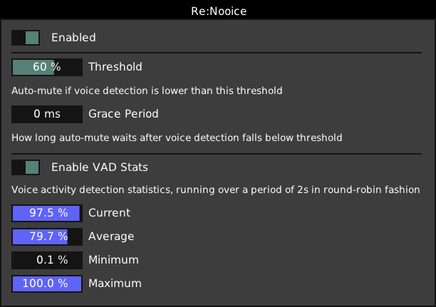

# DISTRHO Re:Nooice

A noise suppression CLAP / LADSPA / LV2 / VST2 / VST3 audio plugin based on a recurrent neural network, specially tailored for speech and voice.

The heavy lifting is done by the [RNNoise](https://gitlab.xiph.org/xiph/rnnoise) project, this plugin is mostly a wrapper around that so that we can use it in real-time and within a regular audio plugin host.

This plugin has a fixed latency of 10ms, as that is the processing block size from RNNoise.

Also, THIS IS A WORK IN PROGRESS.

Progress so far:
 - [x] Automated build for Linux, macOS and Windows
 - [x] Optimized builds under x86 or NEON
 - [x] Exported shared library through [MAPI](https://github.com/DISTRHO/MAPI) (to be used for web-assembly)
 - [x] Report latency to host
 - [x] Click-free bypass
 - [x] Add "VAD Threshold" alike in [werman/noise-suppression-for-voice](https://github.com/werman/noise-suppression-for-voice)
 - [x] Smooth mute/unmute transition for "VAD Threshold"
 - [x] Add custom UI
 - [ ] Dynamic resampling (RNNoise expects 48kHz rate)
 - [ ] More comprehensive UI
 - [ ] More comprehensive README and documentation
 - [ ] Make a 1.0 release
 - [ ] Package it in KXStudio repositories

Because people will ask for it, current screenshot:

